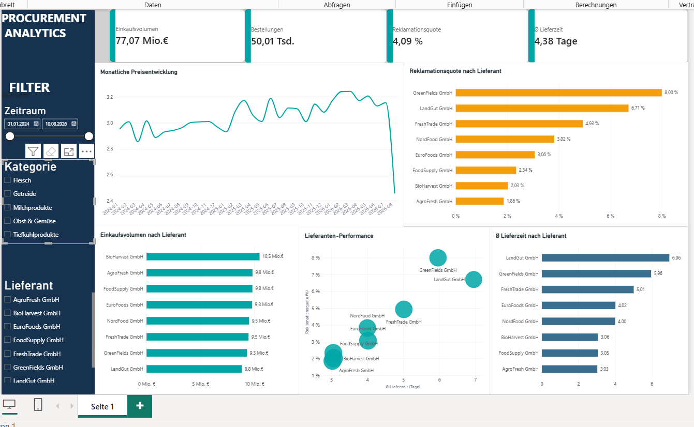

# Procurement KPI Dashboard

## Projektübersicht

Ziel dieses Projekts ist der Aufbau eines automatisierten Procurement-Analytics-Workflows zur Analyse zentraler Einkaufskennzahlen.

Neue Einkaufsdaten können als CSV-Dateien in die Datenpipeline aufgenommen, mit Python und Pandas bereinigt und validiert, in einer PostgreSQL-Datenbank gespeichert und anschließend in einem interaktiven Power-BI-Dashboard analysiert werden.

Das Dashboard unterstützt insbesondere die Analyse von:

- Einkaufsvolumen
- Reklamationsquote
- durchschnittlicher Lieferzeit
- Preisentwicklung
- Lieferanten-Performance

## Tech Stack

- Python
- Pandas
- PostgreSQL
- SQL
- Power BI
- DAX


## Datenpipeline

Der Datenfluss des Projekts ist in mehrere Schritte unterteilt:

1. Neue CSV-Dateien werden im Ordner `data/incoming` abgelegt.
2. Das Python-Skript `clean_procurement_data.py` liest die vorhandenen Rohdaten und neuen Dateien ein.
3. Die Daten werden auf fehlende Werte, Duplikate und ungültige Werte geprüft.
4. Datums- und Textfelder werden bereinigt und die Daten validiert.
5. Die bereinigten Daten werden als `data/processed/procurement_clean.csv` gespeichert.
6. `load_to_postgres.py` lädt den aktuellen Datenbestand in PostgreSQL.
7. Power BI greift auf PostgreSQL zu und aktualisiert das Dashboard.

### Workflow

`CSV → Python/Pandas → Data Cleaning & Validation → PostgreSQL → Power BI`


## KPIs und Analysen

Das Power-BI-Dashboard stellt vier zentrale Einkaufs-KPIs dar:

- **Einkaufsvolumen** – Summe der gesamten Beschaffungskosten
- **Bestellungen** – Gesamtzahl der Bestellungen
- **Reklamationsquote** – Anteil der Bestellungen mit Reklamation
- **Ø Lieferzeit** – durchschnittliche Lieferzeit in Tagen

Zusätzlich enthält das Dashboard fünf Analysen:

1. Monatliche Preisentwicklung
2. Einkaufsvolumen nach Lieferant
3. Reklamationsquote nach Lieferant
4. Durchschnittliche Lieferzeit nach Lieferant
5. Lieferanten-Performance anhand von Lieferzeit, Reklamationsquote und Einkaufsvolumen

Über die Filter für Zeitraum, Kategorie und Lieferant können die Kennzahlen und Visualisierungen interaktiv analysiert werden.

## SQL-Analysen

Zur Analyse der in PostgreSQL gespeicherten Einkaufsdaten wurden SQL-Abfragen für zentrale Fragestellungen erstellt.

Die SQL-Analysen umfassen:

- Berechnung des gesamten Einkaufsvolumens
- Berechnung der Reklamationsquote
- Einkaufsvolumen nach Lieferant
- Lieferanten-Performance anhand von Lieferzeit, Reklamationsquote und Einkaufsvolumen
- Monatliche Preisentwicklung

Dabei werden unter anderem `SUM`, `AVG`, `COUNT`, `GROUP BY`, `ORDER BY`, `DATE_TRUNC` und bedingte Aggregationen verwendet.

Die vollständigen SQL-Abfragen befinden sich unter:

`sql/procurement_analysis.sql`

## Automatisierter Refresh-Test

Die Datenpipeline wurde mit zusätzlichen Einkaufsdaten getestet.

Für den Test wurden 10 neue Bestellungen als separate CSV-Datei in `data/incoming` hinzugefügt.

Anschließend wurde die Pipeline erneut ausgeführt:

1. Python erkannte die neue CSV-Datei automatisch.
2. Die neuen Daten wurden mit den bestehenden Rohdaten zusammengeführt und validiert.
3. Der bereinigte Datenbestand erhöhte sich von 50.000 auf 50.010 Datensätze.
4. PostgreSQL wurde mit dem aktuellen Datenbestand aktualisiert.
5. Nach dem Refresh in Power BI wurden die neuen Daten im Dashboard berücksichtigt.

Damit wurde der vollständige Datenfluss von neuen CSV-Daten bis zur aktualisierten Visualisierung erfolgreich getestet.

## Projektstruktur

```text
procurement-kpi-dashboard/
│
├── data/
│   ├── incoming/          # Neue Einkaufsdaten
│   ├── raw/               # Ursprüngliche Rohdaten
│   └── processed/         # Bereinigte Daten
│
├── src/
│   ├── clean_procurement_data.py
│   ├── analyze_procurement.py
│   └── load_to_postgres.py
│
├── sql/
│   └── procurement_analysis.sql
│
└── README.md


```


## Zentrale Erkenntnisse

Die Analyse zeigt deutliche Unterschiede zwischen den Lieferanten hinsichtlich Kosten, Lieferzeit und Reklamationsquote.

- Das gesamte Einkaufsvolumen liegt bei rund 77 Mio. €.
- Lieferanten mit längeren Lieferzeiten weisen teilweise auch höhere Reklamationsquoten auf.
- GreenFields GmbH und LandGut GmbH zeigen vergleichsweise hohe Reklamationsquoten und längere Lieferzeiten.
- BioHarvest GmbH und AgroFresh GmbH weisen dagegen kurze Lieferzeiten und niedrige Reklamationsquoten auf.
- Die monatliche Preisentwicklung ermöglicht es, Veränderungen der durchschnittlichen Einkaufspreise über den betrachteten Zeitraum zu erkennen.

Die Kombination aus Einkaufsvolumen, Lieferzeit und Reklamationsquote ermöglicht eine ganzheitlichere Bewertung der Lieferanten und kann als Grundlage für datenbasierte Einkaufsentscheidungen dienen.

## Dashboard

Das interaktive Power-BI-Dashboard bietet einen zentralen Überblick über die wichtigsten Einkaufskennzahlen und ermöglicht Analysen nach Zeitraum, Kategorie und Lieferant.



## Projekt ausführen

### 1. Daten vorbereiten

Neue CSV-Dateien werden im Ordner `data/incoming` abgelegt.

### 2. Daten bereinigen und validieren

```bash
python src/clean_procurement_data.py
```

Das Skript führt Data-Quality-Checks durch, bereinigt die Daten und speichert den validierten Datenbestand unter `data/processed/procurement_clean.csv`.

### 3. Daten in PostgreSQL laden

Vor dem Laden muss die Umgebungsvariable `POSTGRES_PASSWORD` gesetzt sein.

Anschließend:

```bash
python src/load_to_postgres.py
```

Die bereinigten Daten werden in die PostgreSQL-Datenbank `procurement_analytics` geladen.

### 4. Power BI aktualisieren

Das Power-BI-Dashboard ist mit PostgreSQL verbunden. Nach dem Laden neuer Daten kann das Datenmodell in Power BI über **Aktualisieren** neu geladen werden.

